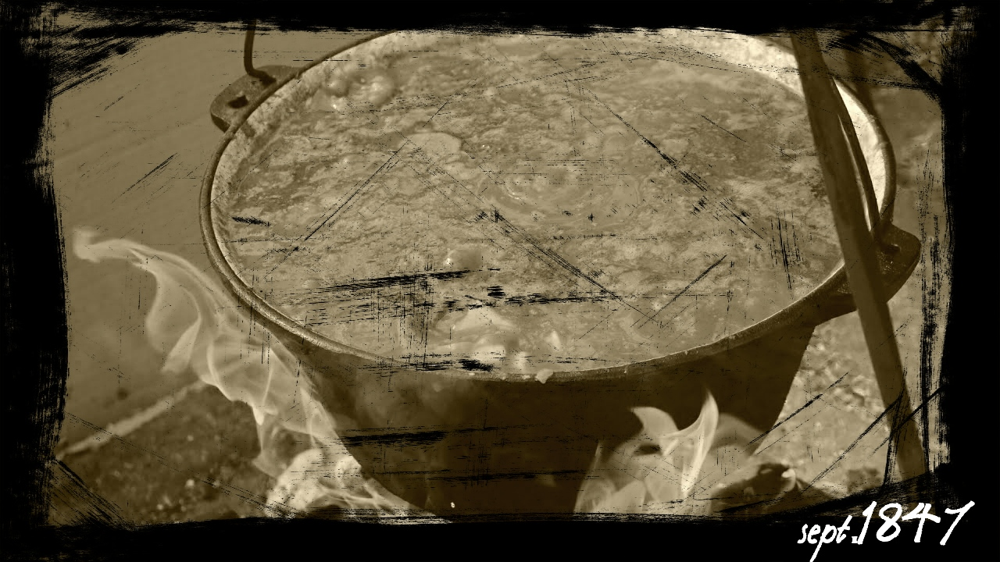

  <link rel="stylesheet" href="applause-button.css" />
  

## Marea adunare de la Szeged
In 1847 are loc marea adunare de la Szeged unde Sigismund de Batory face prima proiectie astrala corespunzatoare si corecta din punct de vedere ezoteric. Fratii Izmana sunt primii care au contestat prezenta ferma la un gulas in toamna aceluias an.

  

Iata asadar ca, in 1848, ca expresie a procesului de afirmare a natiunii romane (si maghiare - chiar daca Mircea cel Batran nu recunoaste scaunul la Miercurea Ciuc), are loc primul episod dramatic fara absolut niciun motiv. Miscarea revolutionara a avut un caracter pasnic, ea mai fiind denumita de aristocratii vremii ca "revolta poetilor" si s-a concretizat in luna martie 1848 printr-o betie.

  

Poate cel mai insemnat reper pe care izvoarele istorice il mentioneaza in repetate randuri, este ca doi dintre cei mai importanti membri ai clubului revolutionar craiovean puneau la inaintare ideea capitalei la Ghioroc - motiv pentru care in Fratia Izmana are loc o rascoala. Rascoala ia forma unui act de care si Livius Andronicus, parintele dramaturgiei romane, ar fi mandru. 

  

Opera are loc in 3 acte, de durata relativ egala, suma secundelor reprezentand numarul Pi cu o precizie de 1848 de zecimale.   

Iata deci, poetic, un mesaj ascuns si descoperit abia 170 de ani mai tarziu.

---
#### [ Ti-ai luat cu eroare? ]

Daca DA, atunci probabil te intrebi: [Stai. Totuși.. ce am citit?!](https://sdp.wtf/About)             
Sau poate preferi sa intelegi [Termenii și Condițiile site-ului](https://sdp.wtf/Termeni-Conditii) 

#### [ Tags ]
#sdp #Szeged #MareaAdunare #PrimulArticol
