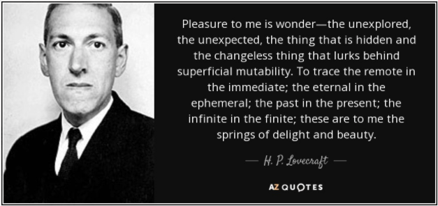

<applause-button style="width: 58px; height: 58px;"/>

Poate un aspect mai puțin discutat reprezintă, in esența ei intrinsecă, discrepanța dintre mit si realitate. Acel subiect aflat la limita posibilului, ce flirteaza cu improbabilul și provoacă fiori precum un thriller bun. 
Desenarea acestei delimitări presupune de cele mai multe ori creativitate, subiectivism si relativism. Aceste 3 aspecte sunt foarte bine descrise de către Pr. dr. Voicu-Viorel Borcan în epopeea de capatai "Dincolo de ce se poate, și nu numai...", epopee ce pune la grea încercare legitimitatea tuturor demonstrațiilor fizice din secolul 19-20. 

  

Puse sub lupa scepticismului, revelațiile lui Einstein nu mai par atat de concrete. 
Teoria relativitatii se confirma si se neagă in mod implicit, demonstrand aceeasi lege la infinit și rezultă fără echivoc ca misterul se află undeva la mijloc, ca și adevărul.

## Test rapid de Prezență

#### Cum ați reactiona daca după serviciu ați merge acasă și brusc conceptul de "acasă" nu ar mai exista in constiinta voastra?

a. Da.  
b.   
c. Pe jos către primul vortex energetic pentru regenerare   
d. Cu taxi.   

#### Ce parere aveti despre home office?

a. Am o parere bună.  
b. Încă mă gandesc la întrebarea 1.  
c. Am toate părerile.   
d. Nu am nicio parere.   

#### Care este răspunsul corect la întrebarea: 

a. Nu există intrebare.   
b. Refularea sexuala conduce la sublimarea pulsiunii sexuale in cultura.  
c. Răspunsul este cu siguranta da.  
d. Cand am fost mic, am fost dus cu forța la Doda Pilii la stană si lăsat în paragină. Foarte frumoase oile.  
e. Dacă aleg sa ignor acest articol nu mai exista nici întrebare, nici răspuns, nici acest articol.  

---
#### [ Ti-ai luat cu eroare? ]

Daca DA, atunci probabil te intrebi: [Stai. Totuși.. ce am citit?!](https://sdp.wtf/About)             
Sau poate preferi sa intelegi [Termenii și Condițiile site-ului](https://sdp.wtf/Termeni-Conditii) 

#### [ Tags ]
#sdp #Îndrumar #FEE #Forte #Exterioare #Energetice #Lovecraft 